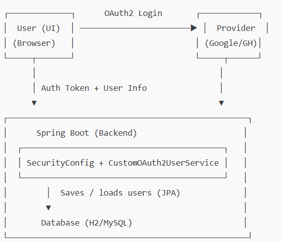

# OAuth2 Login App (Google & GitHub)

A Spring Boot web application that integrates **Google** and **GitHub** OAuth2 login.  
Users can register or log in with either provider, and manage their personal **profile** (name, email, avatar, bio).

---

## 🚀 How to Run

### 1. Prerequisites
- Java 17 or later
- Maven or Gradle
- Google Cloud and GitHub developer credentials
- (Optional) MySQL or PostgreSQL if not using H2

---

### 2. Set Up OAuth Credentials

Create credentials for each provider and add them to your `application.yml`:

```
spring:
  security:
    oauth2:
      client:
        registration:
          google:
            client-id: YOUR_GOOGLE_CLIENT_ID
            client-secret: YOUR_GOOGLE_CLIENT_SECRET
            scope: openid, email, profile
          github:
            client-id: YOUR_GITHUB_CLIENT_ID
            client-secret: YOUR_GITHUB_CLIENT_SECRET
            scope: read:user, user:email
```
### 3. Run the Application
```
mvn spring-boot:run
```

### 4. Access the App

Visit: http://localhost:8080

Click “Login with Google” or “Login with GitHub”

### 🧠 Features
🔐 OAuth2 Login with Google & GitHub

🧾 Automatic user registration on first login

💾 User persistence using JPA (H2 dev DB)

🧍‍♂️ Profile page: shows avatar, name, email, bio

✏️ Profile editing (display name + bio)

🧱 Session-based security (no JWT)

🛡️ CSRF protection for form submissions

🚫 Custom error pages (no Whitelabel errors)

### 📁 Project Structure
| File / Package                          | Description                           |
| --------------------------------------- | ------------------------------------- |
| `model/User.java`                       | User entity model                     |
| `repository/UserRepository.java`        | JPA interface for database access     |
| `security/CustomOAuth2UserService.java` | Handles login, user provisioning      |
| `controller/ProfileController.java`     | Displays and updates profile          |
| `security/SecurityConfig.java`          | Configures OAuth2 login, CSRF, logout |
| `templates/profile.html`                | Profile page template                 |
| `templates/error.html`                  | Custom error page                     |

### 🧱 Database
Default: H2 (in-memory)
Access console at: http://localhost:8080/h2-console

For production, switch to MySQL or PostgreSQL by editing application.yml.

Example H2 settings:
```
spring:
  datasource:
    url: jdbc:h2:mem:testdb
    driver-class-name: org.h2.Driver
    username: sa
    password:
  h2:
    console:
      enabled: true
```
### 🧩 Endpoints
Method   | Endpoint          | Description
--------- | ----------------- | --------------------------------------------
GET       | /                 | Home page (login options)
GET       | /profile          | View profile (authenticated)
POST      | /profile/update   | Update display name and bio
GET       | /logout           | Logout and redirect to home
GET       | /error            | Custom error page
### 📅 Milestones & Deliverables
Milestone | Description                                       | Status
---------- | ------------------------------------------------ | -------
1          | OAuth2 login with one provider                   | ✅
2          | Both providers integrated & user persisted       | ✅
3          | Profile page with protection and logout          | ✅
4 (Final)  | Profile editing, CSRF protection, error handling | ✅
### 🧾 Rubric Alignment (100 pts)
Criteria                                  | Points | Status | Notes
------------------------------------------ | ------- | ------- | ---------------------------------------------
Integration Correctness (Google & GitHub)  | 35      | ✅      | Both providers fully functional
User Provisioning & Persistence            | 20      | ✅      | Users saved via JPA
Security & Access Control                  | 15      | ✅      | Session-based + CSRF protection
Profile Module                             | 15      | ✅      | View and edit implemented
Architecture Docs & Code Quality           | 15      | ✅      | Clean code + updated README documentation
### 🧭 Architecture Overview

### 🧾 How to Logout

Click Logout at the top-right of the profile page → session invalidated → redirected to Home.
### 🧠 Future Improvements

Add timestamp fields (createdAt, updatedAt)

Add a standalone AuthProvider table (optional per rubric)

Support multiple linked providers per user

Improve UI with Bootstrap or TailwindCSS

### Author: Shayne Angus
### Course / Instructor: IT342 / Mr. Frederick Revilleza
### Date: October 13, 2025


